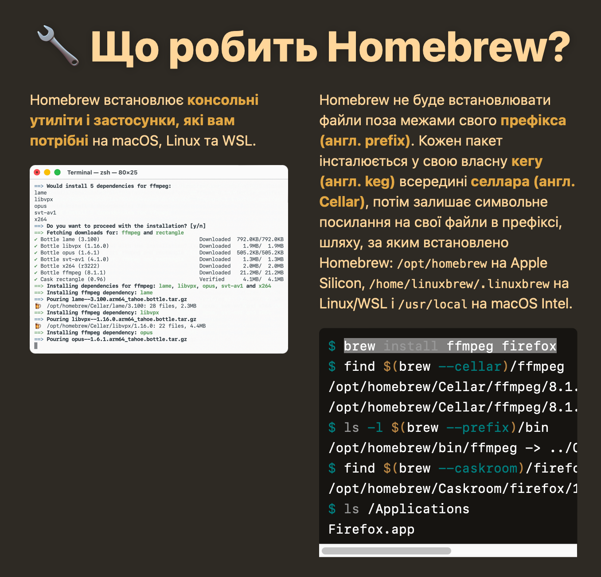
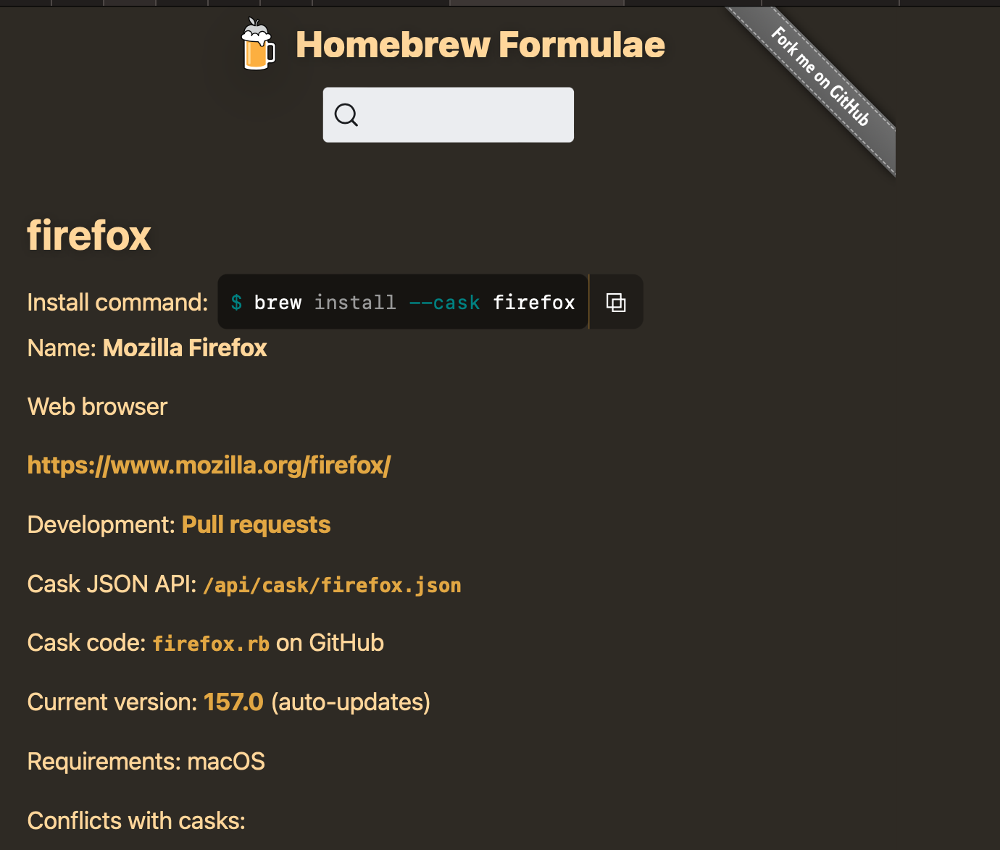
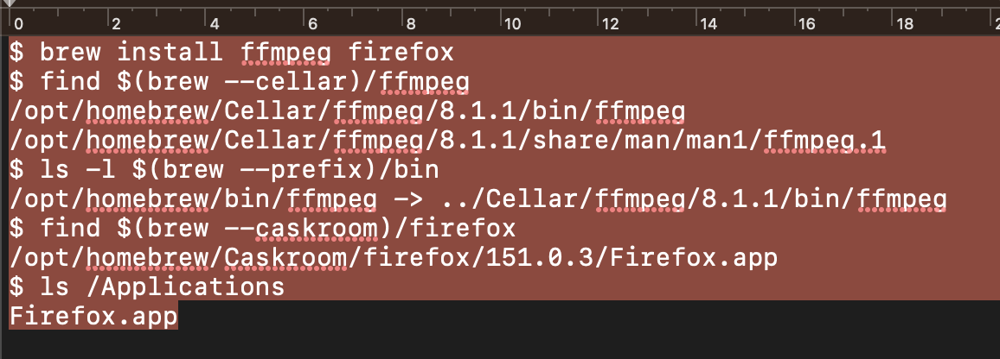

#  Praktikum Sistem Terdistribusi — Minggu 01

**Instalasi Software Pendukung (FFmpeg & Firefox) dan Konfigurasi Git pada macOS 13 menggunakan Homebrew**


---

## 👤 Identitas

| Keterangan | Detail |
|------------|--------|
| **Nama GitHub** | `usatjalung25` |
| **Email** | usat.jalung25@students.utdi.ac.id |
| **Mata Kuliah** | Sistem Terdistribusi |
| **Pertemuan** | Minggu 01 |

---

## 📑 Daftar Isi

1. [Tujuan Praktikum](#-tujuan-praktikum)
2. [Alat dan Bahan](#️-alat-dan-bahan)
3. [Langkah-Langkah Praktikum](#-langkah-langkah-praktikum)
   - [Langkah 1: Instalasi FFmpeg dan Firefox](#langkah-1-instalasi-ffmpeg-dan-firefox)
   - [Langkah 2: Konfirmasi Instalasi](#langkah-2-konfirmasi-instalasi)
   - [Langkah 3: Mencari Lokasi FFmpeg](#langkah-3-mencari-lokasi-ffmpeg)
   - [Langkah 4: Mencari Lokasi Firefox](#langkah-4-mencari-lokasi-firefox)
   - [Langkah 5: Instalasi Firefox via Cask](#langkah-5-instalasi-firefox-via-cask)
   - [Langkah 6: Memeriksa Versi Git](#langkah-6-memeriksa-versi-git)
   - [Langkah 7: Konfigurasi Identitas Git](#langkah-7-konfigurasi-identitas-git)
   - [Langkah 8: Melihat Konfigurasi Git](#langkah-8-melihat-konfigurasi-git)
4. [Hasil dan Analisis](#-hasil-dan-analisis)
5. [Kesimpulan](#-kesimpulan)

---

## 🎯 Tujuan Praktikum

1. Memahami konsep *Version Control System* (VCS) menggunakan Git.
2. Memahami alur kerja kolaborasi pada GitHub: membuat **branch** baru, **pull request (PR)**, **code review**, dan **merge** ke branch utama (`main`/`master`) tanpa merusak kode yang sudah ada.
3. Menginstal software pendukung menggunakan Homebrew, yaitu **FFmpeg** (tool command-line untuk memproses file multimedia) dan **Firefox** (browser web) untuk mendukung lingkungan pengembangan sistem terdistribusi.
4. Memeriksa versi Git dan mengonfigurasi identitas pengguna (nama dan email) pada Git.

---

## 🛠️ Alat dan Bahan

| No | Alat / Bahan |
|----|--------------|
| 1 | Komputer/Laptop dengan sistem operasi **macOS 13** |
| 2 | Koneksi internet |
| 3 | Terminal (bawaan macOS) |
| 4 | Akun GitHub aktif |
| 5 | Homebrew (package manager untuk macOS) |

---

## 💻 Langkah-Langkah Praktikum

### Persiapan: Homebrew

Git untuk Mac OS X tersedia dan dapat diinstal menggunakan **Homebrew**, yaitu package manager di Mac OS X.







---

### Langkah 1: Instalasi FFmpeg dan Firefox

Instalasi lanjutan yang diberikan adalah **FFmpeg** dan **Firefox**. Jalankan perintah berikut di Terminal:

```bash
brew install ffmpeg firefox
```

Homebrew menampilkan daftar paket yang akan dipasang, yaitu `ffmpeg 9.0.2` beserta 21 dependency (openssl@3, readline, sqlite, x264, x265, dan lainnya) serta 1 dependency yang di-upgrade (`cmake`).

### Langkah 2: Konfirmasi Instalasi

Ketika muncul pertanyaan berikut, ketik **`y`** lalu tekan Enter untuk melanjutkan:

```text
==> Do you want to proceed with the installation? [y/n]
y
```

Setelah dikonfirmasi, Homebrew mengunduh seluruh paket dan cask Firefox (versi 157.0). Terdapat dua pesan error pada tahap ini:

```text
Error: ffmpeg: A `brew install ffmpeg firefox` process has already locked /usr/local/Cellar/pkgconf.
Error: firefox: It seems there is already an App at '/Applications/Firefox.app'.
```

- Error pertama muncul karena ada proses `brew install` lain yang masih mengunci direktori `pkgconf`.
- Error kedua muncul karena Firefox sudah terpasang sebelumnya di `/Applications/Firefox.app`.

---

### Langkah 3: Mencari Lokasi FFmpeg

Gunakan perintah berikut untuk mencari file FFmpeg di direktori Cellar Homebrew:

```bash
find $(brew --cellar)/ffmpeg
```

Hasil:

```text
/opt/homebrew/Cellar/ffmpeg/8.1.1/bin/ffmpeg
/opt/homebrew/Cellar/ffmpeg/8.1.1/share/man/man1/ffmpeg.1
```

Untuk memastikan FFmpeg terhubung ke PATH, periksa isi direktori `bin` milik Homebrew:

```bash
ls -l $(brew --prefix)/bin
```

Hasil menunjukkan `ffmpeg` berupa symbolic link ke Cellar:

```text
/opt/homebrew/bin/ffmpeg -> ../Cellar/ffmpeg/8.1.1/bin/ffmpeg
```

---

### Langkah 4: Mencari Lokasi Firefox

Cari file Firefox pada direktori Caskroom Homebrew:

```bash
find $(brew --caskroom)/firefox
```

Hasil:

```text
/opt/homebrew/Caskroom/firefox/151.0.3/Firefox.app
```

Lalu periksa isi folder `/Applications` untuk memastikan aplikasi Firefox ada:

```bash
ls /Applications
```


Hasilnya, `Firefox.app` terdaftar di dalam `/Applications`.

---

### Langkah 5: Instalasi Firefox via Cask

Karena Firefox adalah aplikasi GUI, instalasinya dilakukan menggunakan opsi `--cask`:

```bash
brew install --cask firefox
```


Proses mengunduh Cask Firefox (versi 157.0, sekitar 161,8 MB) dan menginstalnya selesai tanpa error.

---

### Langkah 6: Memeriksa Versi Git

Periksa versi Git yang terpasang:

```bash
git --version
```

Hasil:

```text
git version 2.39.2 (Apple Git-143)
```

### Langkah 7: Konfigurasi Identitas Git

Atur nama pengguna dan email global agar setiap commit tercatat atas nama yang benar.

**Konfigurasi username:**

```bash
git config --global user.name "usatjalung25"
```


**Konfigurasi email:**

```bash
git config --global user.email usat.jalung25@students.utdi.ac.id
```


---

### Langkah 8: Melihat Konfigurasi Git

**Melihat isi file konfigurasi global:**

```bash
cat ~/.gitconfig
```

```ini
[filter "lfs"]
	clean = git-lfs clean -- %f
	smudge = git-lfs smudge -- %f
	process = git-lfs filter-process
	required = true
[user]
	name = usatjalung25
	email = usat.jalung25@students.utdi.ac.id
[http]
	lowSpeedLimit = 1000
	postBuffer = 157286400
[init]
	defaultBranch = main
```

**Melihat seluruh konfigurasi aktif:**

```bash
git config --list
```

```text
credential.helper=osxkeychain
init.defaultbranch=main
filter.lfs.clean=git-lfs clean -- %f
filter.lfs.smudge=git-lfs smudge -- %f
filter.lfs.process=git-lfs filter-process
filter.lfs.required=true
user.name=usatjalung25
user.email=usat.jalung25@students.utdi.ac.id
http.lowspeedlimit=1000
http.postbuffer=157286400
init.defaultbranch=main
```


---

## 📊 Hasil dan Analisis

| Komponen | Status | Keterangan |
|----------|--------|------------|
| **Git** | ✅ Terpasang | Versi `2.39.2 (Apple Git-143)` |
| **FFmpeg** | ✅ Terpasang | Lokasi `/opt/homebrew/Cellar/ffmpeg/8.1.1`, terhubung via symlink `/opt/homebrew/bin/ffmpeg` |
| **Firefox** | ✅ Terpasang | Lokasi `/Applications/Firefox.app` (via Homebrew Cask) |
| **Identitas Git** | ✅ Terkonfigurasi | `user.name` dan `user.email` tersimpan di `~/.gitconfig` |

**Analisis Instalasi**
Perintah `brew install ffmpeg firefox` sempat menghasilkan dua error: direktori `pkgconf` terkunci oleh proses Homebrew lain, dan Firefox sudah ada di `/Applications`. Hal ini menunjukkan bahwa Homebrew mengunci direktori saat proses berjalan untuk mencegah konflik, dan tidak menimpa aplikasi yang sudah ada. Setelah itu, lokasi FFmpeg dan Firefox diverifikasi menggunakan `find` dan `ls`, dan Firefox dipasang ulang dengan `brew install --cask firefox`.

**Analisis Peringatan macOS 13**
Homebrew memberi peringatan bahwa macOS 13 berada pada *Tier 3*, artinya tidak lagi didukung penuh dan paket tidak dibuat dalam bentuk *bottle*, sehingga sebagian paket dapat dikompilasi dari source. Meski begitu, instalasi tetap dapat berjalan.

**Analisis Konfigurasi Git**
Konfigurasi nama dan email penting agar setiap riwayat commit tercatat dengan jelas siapa penulisnya. Pada hasil `git config --list`, terlihat `user.name` dan `user.email` sudah sesuai, serta `init.defaultbranch=main` sehingga repository baru otomatis menggunakan branch `main`.

---

## 🔚 Kesimpulan

Dari praktikum Minggu 01 ini, dapat disimpulkan bahwa:

1. Homebrew memudahkan instalasi dan pengelolaan software di macOS melalui command-line, termasuk aplikasi non-GUI seperti FFmpeg dan aplikasi GUI seperti Firefox (menggunakan `--cask`).
2. Lokasi hasil instalasi dapat diverifikasi dengan perintah `find` dan `ls`, sedangkan error saat instalasi (proses terkunci, aplikasi sudah ada) dapat dipahami dari pesan yang ditampilkan Homebrew.
3. Git berhasil terpasang (`2.39.2`) dan identitas pengguna sudah dikonfigurasi, sehingga siap digunakan untuk melacak perubahan kode dan berkolaborasi melalui GitHub pada pertemuan berikutnya.

---

<p align="center">Dibuat oleh <b>usatjalung25</b> · Praktikum Sistem Terdistribusi</p>
