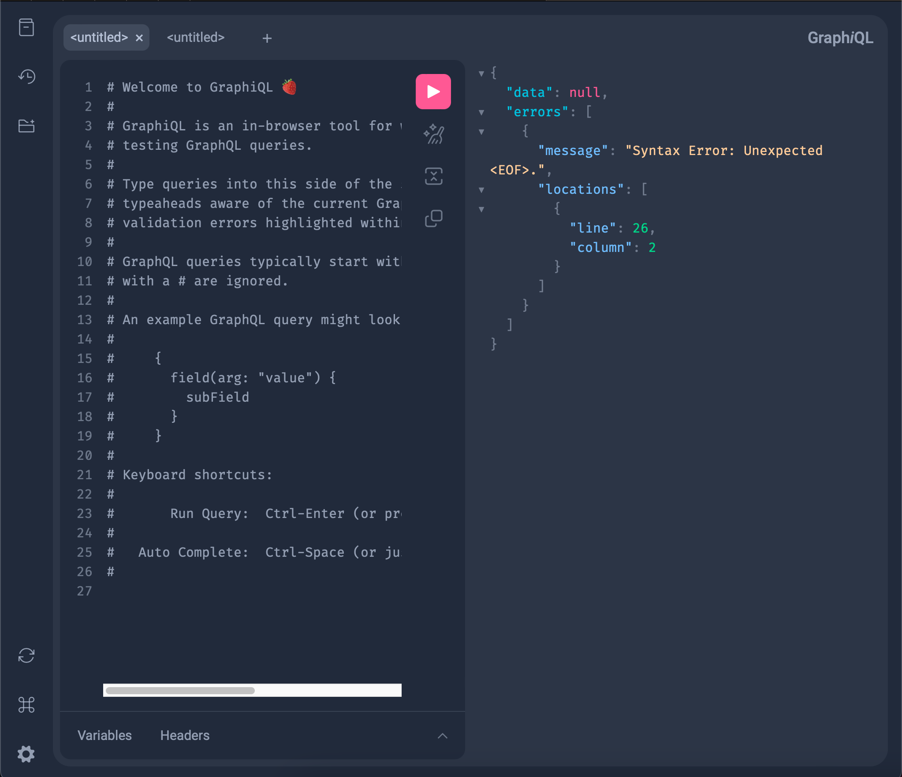
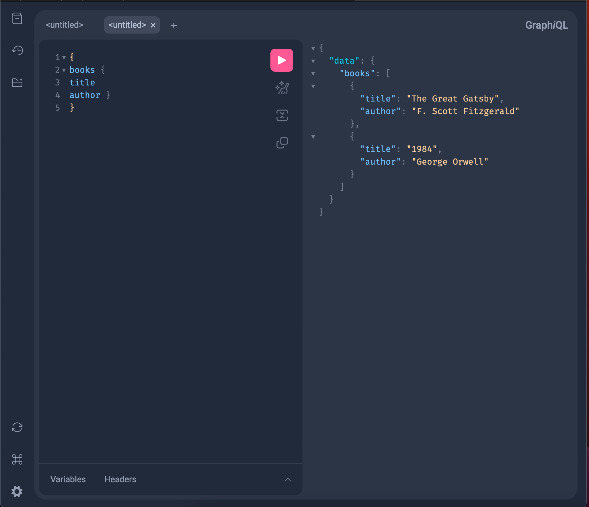

# Modul 2 - Komunikasi Antar Proses pada Sistem Terdistribusi

Praktikum Sistem Terdistribusi dan Terdesentralisasi
Program Studi Informatika - Universitas Teknologi Digital Indonesia

| | |
| --- | --- |
| **Nama** | USAT JALUNG |
| **NIM** | 255410017 |
| **Mata Kuliah** | Praktikum Sistem Terdistribusi dan Terdesentralisasi (IF-1 Ganjil 2026) |

---

## Ringkasan

Modul ini bergerak dari konsep paling dasar (proses pada satu komputer) sampai dua program yang berkomunikasi lewat jaringan (server dan client GraphQL).

| No | Bagian | Yang Dikerjakan | Hasil Utama |
| -- | ------ | --------------- | ----------- |
| 1 | [Proses pada Satu Node](#1-proses-pada-satu-node) | Melihat, menjalankan, dan mematikan proses lewat Task Manager | Satu aplikasi bisa terdiri dari banyak proses |
| 2 | [Paket Python dengan uv](#2-paket-python-dengan-uv) | Instal uv, buat environment `.venv`, pasang `pandas` | Environment terisolasi dan siap pakai |
| 3 | [GraphQL Server](#3-graphql-server-strawberry) | Membuat schema dan menjalankan server dengan Strawberry | Query `books` berhasil di GraphiQL |
| 4 | [GraphQL Client](#4-graphql-client-python) | Membuat client Python, menganalisis dan memperbaiki error `isbn` | Client memeriksa key `errors` dengan benar |

## Daftar Isi

1. [Proses pada Satu Node](#1-proses-pada-satu-node)
2. [Paket Python dengan uv](#2-paket-python-dengan-uv)
3. [GraphQL Server (Strawberry)](#3-graphql-server-strawberry)
4. [GraphQL Client (Python)](#4-graphql-client-python)
5. [Kesimpulan Umum](#5-kesimpulan-umum)
6. [Struktur Repositori](#6-struktur-repositori)
7. [Referensi](#7-referensi)

---

## 1. Proses pada Satu Node

**Tujuan:** memahami bahwa proses adalah program yang sedang dieksekusi dan dikelola sepenuhnya oleh sistem operasi pada satu node.

### Tugas 1 - Menampilkan proses yang ada

Buka **Task Manager** dengan `Ctrl + Shift + Esc`, lalu masuk ke tab **Processes**. Proses dikelompokkan menjadi:

- **Apps**: aplikasi yang dibuka pengguna.
- **Background processes**: proses latar belakang milik sistem operasi dan layanan lain.

Setiap proses menampilkan penggunaan CPU, Memory, Disk, dan Network.


*Gambar 1. Daftar proses yang berjalan pada komputer.*

### Tugas 2 - Menjalankan aplikasi dan melihat proses yang muncul

Saya membuka **Google Chrome**, lalu memeriksa Task Manager lagi. Walaupun hanya satu aplikasi yang dibuka, muncul **banyak proses** dengan nama yang sama: ada proses untuk jendela utama, tab, dan *extension*.

**Penjelasan:** satu aplikasi bisa terdiri dari beberapa proses yang berjalan bersamaan dan saling berkomunikasi. Inilah contoh kecil dari komunikasi antar proses.


*Gambar 2. Proses yang muncul setelah aplikasi dijalankan.*

### Tugas 3 - Mematikan proses tanpa menutup aplikasi

Di Task Manager, klik kanan pada proses aplikasi lalu pilih **End task**. Proses dihentikan paksa oleh sistem operasi, bukan ditutup oleh aplikasinya sendiri.


*Gambar 3. Mematikan proses dengan End task.*

Cara lain lewat Command Prompt:

```
tasklist                          :: melihat daftar proses
taskkill /IM chrome.exe /F        :: mematikan proses berdasarkan nama
taskkill /PID <PID> /F            :: mematikan proses berdasarkan PID
```

Setelah aplikasi dibuka kembali, sistem operasi membuat proses baru dengan **PID yang berbeda** dari sebelumnya.


*Gambar 4. Kondisi proses setelah dimatikan dan dijalankan kembali.*

### Rangkuman langkah

| Langkah | Aksi | Gambar |
| ------- | ---- | ------ |
| 1 | Membuka Task Manager, melihat tab Processes | 1 |
| 2 | Menjalankan Chrome, mengamati proses yang muncul | 2 |
| 3 | Mematikan proses dengan End task | 3 |
| 4 | Menjalankan ulang, melihat proses baru dibuat | 4 |

### Kesimpulan bagian 1

Proses adalah hasil eksekusi program yang dikelola sistem operasi dan terdiri dari *executable code*, data, *resources*, dan informasi *state* (stack dan heap). Pada satu node, pembuatan, pemantauan, dan penghentian proses mudah dilakukan karena semuanya berada di bawah kendali satu sistem operasi.

---

## 2. Paket Python dengan uv

**Tujuan:** menyiapkan environment Python yang terisolasi memakai `uv` agar paket tiap proyek tidak bercampur dengan Python sistem.

| Info | Nilai |
| ---- | ----- |
| Sistem operasi | macOS (x86_64) |
| uv | 0.13.0 |
| Python | CPython 3.12.15 |
| Paket contoh | pandas 3.0.6 |

### Alur kerja

| Langkah | Perintah | Fungsi |
| ------- | -------- | ------ |
| 1. Instal uv | `curl -LsSf https://astral.sh/uv/install.sh \| sh` | Memasang `uv` dan `uvx` ke `~/.local/bin` |
| 2. Buat workspace | `mkdir -p workspace-01 && cd workspace-01` | Folder kerja (`-p` mencegah error jika sudah ada) |
| 3. Lihat versi Python | `uv python list` | Menampilkan versi terpasang dan yang bisa diunduh |
| 4. Pin versi | `uv python pin 3.12` | Menulis `3.12` ke `.python-version` |
| 5. Buat environment | `uv venv` | Membuat folder `.venv` |
| 6. Aktifkan | `source .venv/bin/activate` | Prompt berawalan `(workspace-01)` |
| 7. Instal paket | `uv pip install pandas` | Memasang pandas beserta dependensinya |
| 8. Cek paket | `uv pip list` | Menampilkan paket di dalam `.venv` |
| 9. Simpan daftar | `uv pip freeze > requirements.txt` | Agar environment bisa dibuat ulang (opsional) |

### Output penting dan penjelasannya

**Instalasi uv**

```
downloading uv 0.13.0 x86_64-apple-darwin
skipping sha256 checksum verification (it requires the 'sha256sum' command)
installing to /Users/danel/.local/bin
everything's installed!
```

Baris `skipping sha256 checksum verification` hanya peringatan, bukan error.

**Pin versi**

```
Updated `.python-version` from `/home/bpdp/.local/bin/python3.14` -> `3.12`
```

Kata *Updated* berarti file `.python-version` sudah ada dan berisi path dari komputer lain. Path itu diganti dengan nomor versi `3.12`, yang lebih aman karena berlaku di komputer mana pun.

**Membuat dan mengaktifkan environment**

```
Using CPython 3.12.15
Creating virtual environment at: .venv
```

```
(workspace-01) danel@1111QD-rs workspace-01 % which python
/Users/danel/workspace-01/.venv/bin/python
```

`which python` kini menunjuk ke `.venv/bin/python`, jadi semua paket masuk ke environment ini.

**Instal pandas**

```
Resolved 4 packages in 627ms
Installed 4 packages in 192ms
 + numpy==2.5.3
 + pandas==3.0.6
 + python-dateutil==2.9.0.post0
 + six==1.17.0
```

Yang diminta hanya `pandas`, tetapi terpasang **4 paket** karena pandas membutuhkan `numpy`, `python-dateutil`, dan `six` (dependency).

**Langkah yang menghasilkan error (aman diabaikan)**

```
source $HOME/.local/bin/env
source: no such file or directory: /Users/danel/.local/bin/env
```

File `env` tidak dibuat oleh installer ini. Tidak berpengaruh pada uv, karena `uv venv` dan `uv pip install` tetap berjalan.

### Aktivasi di shell lain

| Shell | Perintah |
| ----- | -------- |
| bash / zsh | `source .venv/bin/activate` |
| fish | `source .venv/bin/activate.fish` |
| Windows CMD | `.venv\Scripts\activate.bat` |
| Windows PowerShell | `.venv\Scripts\Activate.ps1` |

### Error umum dan solusi

| Error | Penyebab | Solusi |
| ----- | -------- | ------ |
| `command not found: uv` | PATH belum berisi `~/.local/bin` | `echo 'export PATH="$HOME/.local/bin:$PATH"' >> ~/.zshrc && source ~/.zshrc` |
| `mkdir: workspace-01: File exists` | Folder sudah ada | Lanjut `cd`, atau pakai `mkdir -p` |
| `No interpreter found for Python 3.x` | Versi belum terpasang | `uv python install 3.12` |
| `A virtual environment already exists` | `.venv` sudah ada | `uv venv --clear` |
| `No virtual environment found` | `.venv` belum dibuat atau aktif | `uv venv` lalu `source .venv/bin/activate` |
| Error jaringan / SSL | Koneksi, proxy, atau sertifikat | `uv --system-certs pip install ...` atau atur `UV_HTTP_TIMEOUT` |
| `No solution found when resolving dependencies` | Konflik versi atau Python terlalu baru | Pakai Python 3.12 atau 3.13 |
| `Failed to build ...` | Compiler belum ada | `xcode-select --install` |

### Struktur akhir workspace

```
workspace-01/
├── .python-version     # berisi: 3.12
├── .venv/              # environment (jangan di-commit)
└── requirements.txt    # opsional
```

Agar `.venv` tidak ikut ter-commit: `echo ".venv/" >> .gitignore`

### Kesimpulan bagian 2

Dengan `uv`, environment dibuat dalam hitungan detik, versi Python terkunci lewat `.python-version`, dan paket yang dipasang tidak mengganggu Python sistem.

---

## 3. GraphQL Server (Strawberry)

**Tujuan:** membuat server GraphQL sederhana dengan **Strawberry** (Python) dan mengujinya lewat **GraphiQL**.

### Konsep singkat

GraphQL adalah alternatif REST API dengan ciri utama:

- **Satu endpoint** (`/graphql`) untuk semua kebutuhan data.
- **Client menentukan data** yang diambil, sehingga tidak ada *over-fetching*. Jika hanya `title` yang diminta, `author` tidak dikirim.
- **Self-documenting**: schema bisa dilihat langsung di GraphiQL.

### Prasyarat

| Kebutuhan | Keterangan |
| --------- | ---------- |
| Python | 3.10+ (diuji pada 3.13) |
| Pengelola paket | pip atau uv |
| Browser | Chrome, Firefox, atau Safari |

### Langkah 1 - Instal paket

Cara A (sesuai modul, memakai uv):

```
uv pip install "strawberry-graphql[cli]"
```

Cara B (yang dipakai pada praktik, pip + FastAPI):

```
python3 -m pip install strawberry-graphql fastapi uvicorn
```

| Paket | Fungsi |
| ----- | ------ |
| `strawberry-graphql` | Mendefinisikan schema GraphQL dengan type hints Python |
| `fastapi` | Framework web yang menjadi tempat endpoint GraphQL |
| `uvicorn` | ASGI server yang menjalankan aplikasi |
| `libcst`, `typer`, `rich` | Dependensi CLI Strawberry (`strawberry dev`) |

> Peringatan `The script uvicorn is installed in ... which is not on PATH` hanya peringatan. Selama server dijalankan dengan `python3 run.py`, program tetap berjalan.

### Langkah 2 - Membuat `schema.py`

```python
import typing
import strawberry

@strawberry.type
class Book:
    title: str
    author: str

def get_books() -> typing.List[Book]:
    return [
        Book(title="The Great Gatsby", author="F. Scott Fitzgerald"),
    ]

@strawberry.type
class Query:
    books: typing.List[Book] = strawberry.field(resolver=get_books)

schema = strawberry.Schema(query=Query)
```

| Bagian kode | Penjelasan |
| ----------- | ---------- |
| `class Book` | Tipe data dengan field `title` dan `author` |
| `get_books()` | *Resolver*, fungsi yang mengembalikan data saat `books` diminta |
| `class Query` | Pintu masuk semua query GraphQL |
| `strawberry.Schema(query=Query)` | Objek schema yang dibaca server (nama `schema` harus sama dengan yang dipanggil di `run.py`) |

### Langkah 3 - Menjalankan server

**Cara A - Strawberry CLI:**

```
strawberry dev schema
```

**Cara B - Script `run.py` (FastAPI + Uvicorn):**

```python
import uvicorn
from fastapi import FastAPI
from strawberry.fastapi import GraphQLRouter
import schema

app = FastAPI()
graphql_app = GraphQLRouter(schema.schema)
app.include_router(graphql_app, prefix="/graphql")

if __name__ == "__main__":
    print("Server berhasil dijalankan!")
    print("Buka browser di: http://127.0.0.1:8000/graphql")
    uvicorn.run(app, host="0.0.0.0", port=8000)
```

```
python3 run.py
```

Output:

```
INFO:     Started server process [14570]
INFO:     Waiting for application startup.
INFO:     Application startup complete.
INFO:     Uvicorn running on http://0.0.0.0:8000 (Press CTRL+C to quit)
```

| Baris log | Arti |
| --------- | ---- |
| `Started server process [14570]` | Proses server dimulai dengan PID 14570 |
| `Waiting for application startup.` | Aplikasi sedang inisialisasi |
| `Application startup complete.` | Aplikasi siap menerima request |
| `Uvicorn running on http://0.0.0.0:8000` | Server aktif di semua interface, port 8000 |

> Terminal tidak boleh ditutup selama server dipakai. Terminal "menggantung" karena server berjalan terus, ini normal.

### Langkah 4 - Membuka GraphiQL

Buka `http://127.0.0.1:8000/graphql` atau `http://localhost:8000/graphql`. Alamat `0.0.0.0` hanya berarti "dengar di semua interface", jadi jangan dipakai di browser.


*Gambar 5. Tampilan awal GraphiQL: kiri editor query, kanan hasil.*

Log server saat halaman dibuka:

```
INFO:     127.0.0.1:50686 - "GET /graphql HTTP/1.1" 200 OK
INFO:     127.0.0.1:50686 - "POST /graphql HTTP/1.1" 200 OK
INFO:     127.0.0.1:50686 - "GET /favicon.ico HTTP/1.1" 404 Not Found
```

- `GET /graphql ... 200 OK`: halaman GraphiQL berhasil dimuat.
- `POST /graphql ... 200 OK`: GraphiQL mengirim query (misalnya *introspection*).
- `GET /favicon.ico ... 404`: normal, browser meminta ikon tab yang memang tidak disediakan server.

### Langkah 5 - Menjalankan query

```graphql
{
  books {
    title
    author
  }
}
```



*Gambar 6. Query di editor GraphiQL.*

Hasil di panel kanan:

```json
{
  "data": {
    "books": [
      {
        "title": "The Great Gatsby",
        "author": "F. Scott Fitzgerald"
      }
    ]
  }
}
```



*Gambar 7. Hasil query di GraphiQL.*

### Pembahasan output

| Bagian response | Penjelasan |
| --------------- | ---------- |
| `data` | Hasil query yang sukses. Bentuknya sama persis dengan bentuk query. |
| `books` | Field pada `Query`. Nilainya array karena tipenya `List[Book]`. |
| `title`, `author` | Field yang diminta. Field yang tidak diminta tidak dikirim. |
| `errors` | Muncul hanya jika terjadi kesalahan. |

**Mengapa semua request berstatus `200 OK`?** Pada GraphQL, query yang salah tetap dibalas HTTP 200. Detail kesalahan ada di key `errors` pada body JSON, jadi yang diperiksa adalah isi response, bukan hanya status HTTP.

**Pesan `Syntax Error: Unexpected <EOF>`** muncul saat server menerima query yang hanya berisi komentar (baris berawalan `#`) atau kosong, sehingga parser menemukan akhir teks sebelum ada perintah valid. Tidak berbahaya: hapus komentar bawaan editor atau tulis query lengkap.

### Menghentikan server

Tekan `Ctrl + C`:

```
INFO:     Shutting down
INFO:     Application shutdown complete.
INFO:     Finished server process [14570]
```

### Troubleshooting

| Error | Penyebab | Solusi |
| ----- | -------- | ------ |
| `No module named 'libcst'` | Strawberry dipasang tanpa extras CLI | `python3 -m pip install "strawberry-graphql[cli]"` atau jalankan lewat `run.py` |
| `No module named 'schema'` / `'strawberry'` / `'fastapi'` | `run.py` tidak satu folder dengan `schema.py`, atau paket terpasang di Python berbeda | Cek dengan `ls`, pakai pasangan `python3 -m pip` dan `python3` |
| `Address already in use` / `[Errno 48]` | Port 8000 dipakai proses lain | `lsof -i :8000` lalu `kill -9 <PID>`, atau ganti port |
| `script ... is not on PATH` | Folder script pip belum ada di PATH | Jalankan via `python3 -m ...` atau tambahkan ke PATH di `~/.zshrc` |
| `command not found: strawberry` | Paket belum terpasang atau PATH belum diatur | `python3 -m strawberry dev schema` |
| Browser tidak bisa membuka halaman | Server mati, memakai `0.0.0.0`, lupa `/graphql`, atau port berbeda | Jalankan ulang server dan buka `http://127.0.0.1:8000/graphql` |
| `Cannot query field "xxx" on type "Query"` | Nama field tidak ada di schema (case-sensitive) | Samakan dengan `schema.py` atau lihat tab Docs |
| Perubahan `schema.py` tidak muncul | Server tanpa auto-reload | Restart server, atau `uvicorn.run("run:app", ..., reload=True)` |

### Kesimpulan bagian 3

Schema Strawberry didefinisikan dengan type hints Python, lalu disajikan lewat satu endpoint `/graphql` dan diuji interaktif di GraphiQL. Server berhasil mengembalikan data `books` sesuai field yang diminta.

---

## 4. GraphQL Client (Python)

**Tujuan:** membuat client Python yang mengambil data dari server GraphQL, lalu menganalisis dan memperbaiki error yang muncul.

| Item | Keterangan |
| ---- | ---------- |
| Server | `run.py` (Uvicorn, port `8000`) |
| Client | `client.py` (Python + `requests`) |
| Endpoint | `http://127.0.0.1:8000/graphql` |

Alur kerja:

```
client.py / curl / GraphiQL  --(POST query)-->  Server GraphQL (run.py)
                             <--(JSON data atau errors)--
```

### Istilah penting

| Istilah | Arti |
| ------- | ---- |
| **Schema** | Daftar type dan field yang disediakan server, "kontrak" antara server dan client |
| **Query** | Permintaan data dari client, field dipilih sendiri |
| **Introspection** | Bertanya ke server tentang schema-nya sendiri, misalnya lewat `__type` |
| **GraphiQL** | Antarmuka web untuk menulis dan menjalankan query di browser |

### Cara menjalankan

Gunakan **dua terminal**.

```
# Instal dependensi client
pip install requests

# Terminal 1 - server
python3 run.py

# Terminal 2 - client
python3 client.py
```

Hentikan server dengan `Ctrl + C` di Terminal 1.

Cek cepat bahwa server hidup:

```
curl -s -X POST http://127.0.0.1:8000/graphql \
  -H "Content-Type: application/json" \
  -d '{"query": "{ __typename }"}'
```

### Hasil percobaan

**Percobaan 1 - Server menerima request**


*Gambar 8. Server berjalan dan mencatat request.*

Server aktif di `0.0.0.0:8000` dan setiap request tercatat `POST /graphql HTTP/1.1" 200 OK`. Di sela log muncul `Cannot query field 'isbn' on type 'Book'.` beserta posisi `baris:kolom`. Status tetap `200` karena error GraphQL dikirim lewat body JSON.

**Percobaan 2 - Introspection lewat curl dan menjalankan client**


*Gambar 9. Introspection dengan curl dan hasil `client.py` versi awal.*

- Introspection `__type(name: "Book")` menunjukkan `Book` hanya punya `title` dan `author`.
- `client.py` versi awal masih meminta `isbn`, sehingga hasilnya `"data": null` dengan pesan error.
- Client versi awal tetap mencetak "Berhasil" karena hanya memeriksa status HTTP, bukan key `errors`. Ini bug pada client dan sudah diperbaiki.

**Percobaan 3 - Introspection di GraphiQL**


*Gambar 10. Query introspection di GraphiQL.*

```graphql
{
  __type(name: "Book") {
    fields {
      name
    }
  }
}
```

Hasilnya memuat `title` dan `author`, sama dengan pengecekan lewat curl. Ini cara paling mudah memastikan field apa saja yang boleh diminta.

**Percobaan 4 - Error `isbn` di GraphiQL**


*Gambar 11. Field `isbn` ditandai garis merah dan ditolak server.*

GraphiQL menandai `isbn` dengan garis merah sebelum query dijalankan. Hasilnya `"data": null` dan pesan `Cannot query field 'isbn' on type 'Book'.` pada `line: 3, column: 5`.

### Analisis error

```json
{
  "data": null,
  "errors": [
    {
      "message": "Cannot query field 'isbn' on type 'Book'.",
      "locations": [{ "line": 3, "column": 5 }]
    }
  ]
}
```

| Pertanyaan | Jawaban |
| ---------- | ------- |
| Apa penyebabnya? | Field `isbn` tidak ada di type `Book` pada schema server. |
| Kenapa `data` jadi `null`? | GraphQL memvalidasi query sebelum dijalankan. Satu field tidak dikenal membuat seluruh query ditolak, termasuk `title` dan `author`. |
| Kenapa HTTP tetap `200 OK`? | Error GraphQL dikirim di body JSON (key `errors`), bukan lewat status HTTP. |
| Kenapa client lama bilang "Berhasil"? | Client hanya memeriksa status HTTP dan tidak membaca key `errors`. |
| Di mana letak kesalahannya? | Pada `locations`: baris dan kolom field yang bermasalah. |

### Cara mengatasi error

**Solusi 1 - Hapus `isbn` dari query (tercepat):**

```graphql
{
  books {
    title
    author
  }
}
```

```
curl -s -X POST http://127.0.0.1:8000/graphql \
  -H "Content-Type: application/json" \
  -d '{"query": "{ books { title author } }"}' | python3 -m json.tool
```

**Solusi 2 - Tambahkan `isbn` di server** (jika datanya memang dibutuhkan):

1. Buka schema dan tambahkan field `isbn: str` pada type `Book`.
2. Tambahkan nilai `isbn` pada setiap data buku.
3. Restart server (`Ctrl + C`, lalu `python3 run.py`). Tanpa restart, schema lama masih dipakai.
4. Cek ulang lewat introspection, lalu jalankan query yang memakai `isbn`.

**Checklist verifikasi**

- [ ] Server berjalan dan log menampilkan `Application startup complete`
- [ ] Introspection `__type(name: "Book")` menampilkan field yang dibutuhkan
- [ ] Query hanya memakai field yang ada di hasil introspection
- [ ] Respons berisi `data` yang tidak `null` dan tanpa key `errors`
- [ ] `python3 client.py` mencetak data buku, bukan pesan `Server menolak query`

### Kode client (versi perbaikan)

Perbedaan dengan versi awal: hanya meminta field yang ada di schema, dan memeriksa key `errors`.

```python
import json
import requests

URL = "http://127.0.0.1:8000/graphql"

# Hanya field yang ada di schema: title dan author
query = """
{
    books {
        title
        author
    }
}
"""

print("Mengirim query ke server GraphQL...")
try:
    response = requests.post(URL, json={"query": query}, timeout=5)
    response.raise_for_status()

    result = response.json()

    # GraphQL membalas HTTP 200 meski query salah,
    # jadi key "errors" harus dicek sendiri.
    if "errors" in result:
        print("\nServer menolak query:")
        for err in result["errors"]:
            print(" -", err["message"])
    else:
        print("\nBerhasil. Berikut adalah data dari server:")
        print(json.dumps(result, indent=2))

except requests.exceptions.ConnectionError:
    print("\nGagal terhubung ke server.")
    print("Pastikan server sudah dijalankan dengan 'python3 run.py'")
except Exception as e:
    print(f"\nTerjadi kesalahan: {e}")
```

### Kesimpulan bagian 4

Client dan server berkomunikasi lewat HTTP `POST` dengan body JSON. Karena GraphQL selalu membalas `200 OK`, client yang benar wajib memeriksa key `errors`. Field yang diminta harus sesuai schema, dan introspection adalah cara tercepat untuk memastikannya.

---

## 5. Kesimpulan Umum

1. **Proses** adalah unit eksekusi yang dikelola sistem operasi. Satu aplikasi dapat berupa banyak proses yang saling berkomunikasi.
2. **Environment terisolasi** (`uv` + `.venv`) membuat setiap proyek memiliki paket dan versi Python sendiri.
3. **Server GraphQL** menyediakan data lewat satu endpoint dan schema yang jelas. Client memilih sendiri data yang dibutuhkan.
4. **Client dan server** adalah dua proses terpisah yang berkomunikasi lewat jaringan. Ini bentuk paling sederhana dari sistem terdistribusi: proses yang berjalan sendiri-sendiri tetapi bekerja sama lewat pertukaran pesan.
5. **Penanganan error** harus dilakukan di sisi client dengan membaca isi response, bukan hanya status HTTP.

---

## 6. Struktur Repositori

```
.
├── README.md
├── 01-Proses pada Satu Node.md
├── 02-Paket Python.md
├── 03-GraphQL Server.md
├── 04-client.md
├── schema.py                  # Schema GraphQL (Book, Query)
├── run.py                     # Server (FastAPI + Uvicorn)
├── client.py                  # Client Python
└── images/
    ├── task manager-01.png ... task manager-04.png
    ├── GraphiQL-01.png ... GraphiQL-03.png
    └── GraphQL Client -01.png, GraphQL Client-02.png ... GraphQL Client-04.png
```

## 7. Referensi

- Dokumentasi uv: <https://docs.astral.sh/uv/>
- Panduan instalasi uv: <https://docs.astral.sh/uv/getting-started/installation/>
- Strawberry GraphQL: <https://strawberry.rocks/>
- Panduan asli oleh Dr. Bambang Purnomosidi D. P.: <https://github.com/bpdp>
